# Database Design

## Document Control

| Field | Value |
| --- | --- |
| Product | Disyn Vocational Learning Ecosystem |
| Document | Database Design |
| Version | 0.1.0 |
| Status | Draft for stakeholder review |
| Date | 2026-07-01 |
| Depends On | docs/01-product-requirements-document.md, docs/02-information-architecture.md, docs/03-software-architecture.md |
| Repository | C:\Users\Hp\Disyn |

## 1. Purpose

This document defines the target database design for Disyn. It covers the enterprise PostgreSQL model, multi-tenant isolation, core entities, ER diagram, Prisma schema direction, indexes, constraints, migrations, seed data, audit tables, soft delete strategy, and data lifecycle rules.

This is a design artifact. It does not modify the current production Prisma schema yet.

## 2. Current Repository Baseline

The existing `prisma/schema.prisma` is a starter schema with the following models:

- `User`
- `Project`
- `Package`
- `Lead`
- `AnalyticsLog`

Those models appear to support a portfolio or lead-generation site, not the target vocational learning ecosystem. The enterprise LMS schema must be introduced through a deliberate foundation migration rather than by mixing unrelated legacy tables into the long-term domain model.

Decision:

- Treat the current schema as pre-foundation.
- Do not extend the portfolio schema into the LMS domain.
- During the foundation implementation phase, create a migration plan that either archives, renames, or removes legacy models depending on whether any production data must be preserved.
- Replace the current default admin seed behavior before production. A hardcoded fallback admin password must not exist in production seed logic.

## 3. Database Architecture Decisions

| Decision | Choice | Rationale |
| --- | --- | --- |
| Primary database | PostgreSQL | Strong relational integrity is required for tenants, roles, enrollments, assessments, credentials, audit, and official records. |
| ORM | Prisma | Type-safe access and migrations, while repository ports prevent domain logic from depending directly on Prisma. |
| Identifier type | UUID for target enterprise schema | UUIDs are safer for distributed systems, public URLs, imports, and future service extraction than sequential IDs. |
| Tenant model | Shared database, tenant-scoped records, optional dedicated deployments | Supports SaaS efficiency and enterprise isolation options. |
| Tenant enforcement | Application checks, repository tenant requirements, composite indexes, optional PostgreSQL RLS | Tenant leakage is a critical security risk, so isolation must be layered. |
| Event reliability | Outbox table in PostgreSQL | State changes and event publication must be transactionally linked. |
| Audit model | Append-only audit tables | Sensitive actions and official records require traceability. |
| Soft delete | Standard nullable `deleted_at` for recoverable records | Avoids accidental data loss while preserving auditability. |
| Official records | No soft delete for issued credentials, assessment attempts, audit logs, and outbox history | These records represent legal or academic history. Use status changes such as revoked, voided, or archived. |
| Read models | Projection tables for analytics, reporting, search, and verification | Large tenants need fast dashboards without overloading transactional tables. |
| Vector data | External vector store or PostgreSQL `pgvector` behind an adapter | The architecture should allow provider choice without changing AI domain logic. |

## 4. PostgreSQL Standards

### 4.1 Required Extensions

| Extension | Purpose | Required |
| --- | --- | --- |
| `pgcrypto` | UUID generation and cryptographic helpers | Yes |
| `citext` | Case-insensitive email and slug fields | Recommended |
| `pg_trgm` | Fuzzy search for names, titles, and certificate numbers | Recommended |
| `unaccent` | Better multilingual search normalization | Recommended |
| `vector` | Embeddings if using PostgreSQL pgvector | Optional |

Prisma cannot express every PostgreSQL feature directly. SQL migrations must be allowed for extensions, partial indexes, advanced check constraints, triggers, RLS policies, and vector indexes.

### 4.2 Naming Conventions

| Object | Convention | Example |
| --- | --- | --- |
| Tables | snake_case plural | `course_lessons` |
| Columns | snake_case | `tenant_id` |
| Primary keys | `id` UUID | `id uuid primary key` |
| Foreign keys | `{entity}_id` | `course_id` |
| Unique constraints | `uq_{table}_{columns}` | `uq_courses_tenant_slug_active` |
| Indexes | `idx_{table}_{columns}` | `idx_enrollments_tenant_learner` |
| Check constraints | `ck_{table}_{rule}` | `ck_assessment_attempts_score_range` |
| Foreign keys | `fk_{table}_{referenced}` | `fk_courses_tenant` |

Prisma model names may use PascalCase while mapping to snake_case tables through `@@map`.

### 4.3 Common Columns

Most tenant-scoped operational tables should include:

| Column | Type | Purpose |
| --- | --- | --- |
| `id` | UUID | Stable primary key. |
| `tenant_id` | UUID | Tenant boundary. |
| `created_at` | timestamptz | Creation timestamp. |
| `updated_at` | timestamptz | Last update timestamp. |
| `created_by_id` | UUID nullable | User who created record. |
| `updated_by_id` | UUID nullable | User who last updated record. |
| `deleted_at` | timestamptz nullable | Soft delete marker for recoverable records. |
| `deleted_by_id` | UUID nullable | Actor who soft deleted record. |
| `version` | integer | Optimistic concurrency for editable records. |

Exceptions:

- Audit logs are append-only and do not use `updated_at` or `deleted_at`.
- Outbox events use processing metadata instead of update metadata.
- Join tables may omit audit columns when their parent aggregate emits audit events.
- Official records use status fields instead of soft delete.

## 5. Multi-Tenancy Data Model

### 5.1 Tenant Boundary

Every tenant-scoped table must include `tenant_id` unless it is truly global. Global tables must be rare and reviewed.

Global tables:

- `users`
- `permissions`
- `platform_feature_flags`
- `system_settings`
- selected immutable reference taxonomies

Tenant-scoped tables:

- Organizations.
- Memberships.
- Roles.
- Programs.
- Courses.
- Content.
- Assessments.
- Credentials.
- Media.
- Notifications.
- AI data.
- Search documents.
- Analytics projections.
- Audit logs.

### 5.2 Tenant Consistency

Tenant consistency must be enforced at multiple layers:

- Application use cases require tenant context.
- Repository methods require tenant ID for tenant-scoped records.
- Foreign keys should use composite references where practical.
- Critical cross-table tenant consistency should use SQL constraints or triggers when Prisma cannot express the rule.
- Optional PostgreSQL Row Level Security can be enabled for high-security deployments.

Example:

- A course belongs to tenant A.
- A module inside that course must also belong to tenant A.
- A lesson inside that module must also belong to tenant A.
- An assessment attached to that lesson must also belong to tenant A.

The database design stores `tenant_id` redundantly on child tables. This is intentional. It improves query performance, authorization filtering, partitioning options, and tenant isolation tests.

## 6. High-Level ER Diagram

```mermaid
erDiagram
    USERS ||--o{ MEMBERSHIPS : has
    TENANTS ||--o{ MEMBERSHIPS : contains
    TENANTS ||--o{ ORGANIZATIONS : owns
    TENANTS ||--o{ ROLES : defines
    ROLES ||--o{ ROLE_PERMISSIONS : grants
    PERMISSIONS ||--o{ ROLE_PERMISSIONS : included_in
    MEMBERSHIPS ||--o{ MEMBERSHIP_ROLES : assigned
    ROLES ||--o{ MEMBERSHIP_ROLES : assigned_to

    TENANTS ||--o{ TRAINING_CENTERS : has
    ORGANIZATIONS ||--o{ DEPARTMENTS : has
    ORGANIZATIONS ||--o{ COHORTS : has

    TENANTS ||--o{ PROGRAMS : offers
    PROGRAMS ||--o{ COURSES : contains
    COURSES ||--o{ COURSE_MODULES : contains
    COURSE_MODULES ||--o{ LESSONS : contains
    LESSONS ||--o{ LESSON_TOPICS : contains
    LESSON_TOPICS ||--o{ LEARNING_ACTIVITIES : contains

    PROGRAMS ||--o{ PROGRAM_COMPETENCIES : maps
    COURSES ||--o{ COURSE_OUTCOMES : defines
    COMPETENCIES ||--o{ PROGRAM_COMPETENCIES : included
    LEARNING_OUTCOMES ||--o{ COURSE_OUTCOMES : included
    QUALIFICATION_FRAMEWORKS ||--o{ QUALIFICATION_LEVELS : contains
    QUALIFICATION_LEVELS ||--o{ COMPETENCIES : organizes

    USERS ||--o{ ENROLLMENTS : learner
    COURSES ||--o{ ENROLLMENTS : enrolled_in
    COHORTS ||--o{ ENROLLMENTS : groups
    ENROLLMENTS ||--o{ LESSON_PROGRESS : tracks
    ENROLLMENTS ||--o{ ASSESSMENT_ATTEMPTS : attempts

    COURSES ||--o{ ASSESSMENTS : includes
    ASSESSMENTS ||--o{ ASSESSMENT_ITEMS : contains
    QUESTIONS ||--o{ ASSESSMENT_ITEMS : reused
    ASSESSMENTS ||--o{ ASSESSMENT_ATTEMPTS : attempted
    ASSESSMENT_ATTEMPTS ||--o{ ASSESSMENT_SUBMISSIONS : submits
    RUBRICS ||--o{ RUBRIC_CRITERIA : defines
    RUBRICS ||--o{ ASSESSMENTS : evaluates

    PROGRAMS ||--o{ CREDENTIAL_RULES : awards
    CREDENTIAL_TEMPLATES ||--o{ ISSUED_CREDENTIALS : renders
    USERS ||--o{ ISSUED_CREDENTIALS : receives
    ISSUED_CREDENTIALS ||--o{ CREDENTIAL_REVOCATIONS : may_have
    ISSUED_CREDENTIALS ||--o{ CREDENTIAL_VERIFICATIONS : verified_by
    ISSUED_CREDENTIALS ||--o{ WALLET_ITEMS : stored_as

    TENANTS ||--o{ MEDIA_FILES : stores
    MEDIA_FILES ||--o{ FILE_USAGES : referenced_by
    TENANTS ||--o{ CMS_PAGES : publishes
    TENANTS ||--o{ KNOWLEDGE_SOURCES : approves
    KNOWLEDGE_SOURCES ||--o{ KNOWLEDGE_CHUNKS : indexes
    USERS ||--o{ AI_INTERACTIONS : asks

    TENANTS ||--o{ NOTIFICATIONS : sends
    USERS ||--o{ NOTIFICATIONS : receives
    TENANTS ||--o{ AUDIT_LOGS : records
    TENANTS ||--o{ OUTBOX_EVENTS : emits
```



This ER diagram is intentionally high-level. Detailed relationships are defined in the table catalogue below.

## 7. Domain Table Catalogue

### 7.1 Identity and Access

| Table | Purpose | Tenant Scoped | Soft Delete |
| --- | --- | --- | --- |
| `users` | Global identity record. | No | Yes, restricted |
| `user_profiles` | Personal profile data and preferences. | No | Yes |
| `user_credentials` | Password hashes and credential metadata. | No | No |
| `oauth_accounts` | Linked OAuth providers. | No | Yes |
| `auth_sessions` | Active sessions and device metadata. | No | No, revoke instead |
| `refresh_tokens` | Rotating refresh token records. | No | No, revoke instead |
| `mfa_factors` | MFA methods and verification state. | No | Yes |
| `memberships` | User relationship to a tenant. | Yes | Yes |
| `roles` | Tenant-defined roles. | Yes | Yes |
| `permissions` | Global permission catalogue. | No | No |
| `role_permissions` | Role to permission mapping. | Yes through role | Hard delete allowed through role update |
| `membership_roles` | Membership to role assignment. | Yes | Hard delete allowed through assignment update |

Key rules:

- `users.email` must be globally unique and case-insensitive.
- A user can belong to multiple tenants.
- A membership can have multiple roles.
- Platform super admin access should be represented separately from tenant membership or through a tightly controlled platform role.
- Password hashes must never be returned through APIs.

### 7.2 Tenancy and Organization

| Table | Purpose | Tenant Scoped | Soft Delete |
| --- | --- | --- | --- |
| `tenants` | Customer boundary and lifecycle. | No | No, status instead |
| `organizations` | Branded institution profile. | Yes | Yes |
| `tenant_domains` | Domains and subdomains. | Yes | Yes |
| `organization_branding` | Logo, colors, theme, certificate visual defaults. | Yes | Yes |
| `training_centers` | Physical or virtual delivery units. | Yes | Yes |
| `departments` | Organizational departments. | Yes | Yes |
| `teams` | Staff teams and operational groups. | Yes | Yes |
| `team_members` | Membership in operational teams. | Yes | Hard delete allowed |
| `cohorts` | Learner groups for delivery periods. | Yes | Yes |
| `tenant_settings` | Configurable policies and settings. | Yes | No |
| `platform_feature_flags` | Global feature flag catalogue. | No | No |
| `tenant_feature_flags` | Tenant feature flag values. | Yes | No |

Key rules:

- `tenant_domains.domain` must be globally unique.
- Only verified domains can route tenant traffic.
- Tenant status controls platform access.
- Tenant settings are versioned through audit events.

### 7.3 Curriculum and Competency

| Table | Purpose | Tenant Scoped | Soft Delete |
| --- | --- | --- | --- |
| `qualification_frameworks` | Internal, national, sectoral, or international frameworks. | Yes | Yes |
| `qualification_levels` | Levels inside a framework. | Yes | Yes |
| `competencies` | Demonstrable skills or capabilities. | Yes | Yes |
| `learning_outcomes` | Measurable learning outcomes. | Yes | Yes |
| `competency_outcomes` | Competency to outcome mapping. | Yes | Hard delete allowed before publication |
| `assessment_criteria` | Criteria used to judge evidence. | Yes | Yes |
| `evidence_rules` | Rules defining required evidence for competence. | Yes | Yes |

Key rules:

- Published competencies should be versioned rather than overwritten.
- Framework mappings must survive course version changes.
- Competency codes should be unique per tenant and framework when provided.

### 7.4 Learning Delivery

| Table | Purpose | Tenant Scoped | Soft Delete |
| --- | --- | --- | --- |
| `programs` | Vocational pathways or qualifications. | Yes | Yes |
| `program_versions` | Version snapshots for published programs. | Yes | No |
| `program_competencies` | Program to competency mapping. | Yes | Hard delete allowed before publication |
| `courses` | Structured learning units. | Yes | Yes |
| `course_versions` | Version snapshots for published courses. | Yes | No |
| `course_modules` | Course sections. | Yes | Yes |
| `lessons` | Learning units. | Yes | Yes |
| `lesson_topics` | Focused content sections. | Yes | Yes |
| `learning_activities` | Activities inside topics or lessons. | Yes | Yes |
| `course_outcomes` | Course to learning outcome mapping. | Yes | Hard delete allowed before publication |
| `course_prerequisites` | Course dependency rules. | Yes | Yes |
| `enrollments` | Learner enrollment in a course or program. | Yes | No, status instead |
| `lesson_progress` | Learner lesson progress. | Yes | No |
| `activity_progress` | Learner activity progress. | Yes | No |
| `completion_records` | Course or program completion record. | Yes | No |
| `bookmarks` | Learner saved learning locations. | Yes | Yes |
| `learner_notes` | Learner notes and annotations. | Yes | Yes |

Key rules:

- Published course content must be versioned.
- Progress must reference the version of content the learner used.
- Completion records are official educational records and should not be deleted.

### 7.5 Assessment

| Table | Purpose | Tenant Scoped | Soft Delete |
| --- | --- | --- | --- |
| `question_banks` | Reusable question collections. | Yes | Yes |
| `questions` | Reusable questions. | Yes | Yes |
| `question_options` | Options for multiple-choice and similar questions. | Yes | Yes |
| `question_versions` | Published question snapshots. | Yes | No |
| `rubrics` | Reusable scoring rubrics. | Yes | Yes |
| `rubric_criteria` | Criteria in rubrics. | Yes | Yes |
| `rubric_levels` | Performance levels per criterion. | Yes | Yes |
| `assessments` | Quizzes, assignments, practicals, exams. | Yes | Yes |
| `assessment_sections` | Sections or pools inside assessments. | Yes | Yes |
| `assessment_items` | Questions or tasks inside assessments. | Yes | Yes |
| `assessment_attempts` | Learner attempts. | Yes | No |
| `assessment_submissions` | Submitted answers or files. | Yes | No |
| `submission_files` | Files attached to submissions. | Yes | No |
| `assessment_grades` | Scores, feedback, grading metadata. | Yes | No |
| `moderation_reviews` | Second review and approval decisions. | Yes | No |
| `practical_evidence` | Evidence records for practical competence. | Yes | No |
| `assessment_accommodations` | Learner accommodations for exams or assessments. | Yes | Yes |

Key rules:

- Attempts must be immutable after final submission, except controlled grade adjustments with audit history.
- Practical evidence must preserve submitted files and assessor decisions.
- High-stakes exams must record timing, IP or device metadata where policy allows, and attempt integrity status.

### 7.6 Credentialing

| Table | Purpose | Tenant Scoped | Soft Delete |
| --- | --- | --- | --- |
| `credential_types` | Completion certificate, competence certificate, diploma, badge, micro-credential. | Tenant or global | No |
| `credential_templates` | Tenant-branded certificate and badge templates. | Yes | Yes |
| `credential_rules` | Eligibility rules for credentials. | Yes | Yes |
| `credential_eligibility` | Learner eligibility calculation state. | Yes | No |
| `issued_credentials` | Official issued credential records. | Yes | No, revoke instead |
| `credential_numbers` | Reserved and issued certificate number registry. | Yes | No |
| `credential_revocations` | Revocation history. | Yes | No |
| `credential_verifications` | Verification events. | Yes | No |
| `transcripts` | Generated transcript records. | Yes | No |
| `wallet_items` | Learner wallet credential references. | Yes | No |
| `credential_shares` | Learner-approved sharing links. | Yes | Yes, expire instead |

Key rules:

- `issued_credentials.certificate_number` must be globally unique.
- Credentials are never deleted after issuance.
- Revocation creates a new revocation record and updates credential status.
- Certificate template changes do not mutate already issued credentials.

### 7.7 CMS and Content

| Table | Purpose | Tenant Scoped | Soft Delete |
| --- | --- | --- | --- |
| `cms_pages` | Public and internal CMS pages. | Yes | Yes |
| `cms_page_versions` | Versioned page content. | Yes | No |
| `navigation_menus` | Public and authenticated menus. | Yes | Yes |
| `navigation_items` | Menu items. | Yes | Yes |
| `homepage_sections` | Tenant homepage sections. | Yes | Yes |
| `footer_sections` | Footer groups and links. | Yes | Yes |
| `announcements` | Audience-targeted announcements. | Yes | Yes |
| `faqs` | Frequently asked questions. | Yes | Yes |
| `blog_posts` | Editorial articles. | Yes | Yes |
| `news_posts` | Institutional news. | Yes | Yes |
| `policy_documents` | Versioned policies. | Yes | Yes |
| `content_reviews` | Review and approval workflow records. | Yes | No |

Key rules:

- Published CMS pages are versioned.
- Policy documents must preserve effective dates and accepted versions.
- Navigation is tenant-configurable but permission-aware for authenticated menus.

### 7.8 Media and File Management

| Table | Purpose | Tenant Scoped | Soft Delete |
| --- | --- | --- | --- |
| `media_files` | File metadata and storage keys. | Yes | Yes |
| `media_variants` | Transcoded, thumbnail, preview, or optimized variants. | Yes | Yes |
| `file_usages` | Where a file is referenced. | Yes | No |
| `file_access_logs` | Sensitive file access events. | Yes | No |
| `file_scan_results` | Malware scan status and results. | Yes | No |

Key rules:

- Object storage paths must include tenant ID or a tenant-safe partition.
- Files should not be physically deleted until retention rules permit it.
- Signed URLs must be short-lived.

### 7.9 AI and Knowledge

| Table | Purpose | Tenant Scoped | Soft Delete |
| --- | --- | --- | --- |
| `knowledge_sources` | Approved source documents, lessons, pages, or media. | Yes | Yes |
| `knowledge_chunks` | Chunk metadata and vector references. | Yes | No, supersede by version |
| `knowledge_ingestion_jobs` | Ingestion lifecycle. | Yes | No |
| `ai_tenant_settings` | Tenant AI policy. | Yes | No |
| `ai_interactions` | AI conversation sessions. | Yes | Retention controlled |
| `ai_messages` | User and assistant messages. | Yes | Retention controlled |
| `ai_source_references` | Sources used in AI answers. | Yes | No |
| `learner_weaknesses` | Weakness signals and mastery gaps. | Yes | Yes |
| `study_plans` | AI or instructor-generated revision plans. | Yes | Yes |

Key rules:

- Retrieval must filter by tenant, source approval, learner access, and content version.
- Embeddings may be stored externally, but `knowledge_chunks` must store `vector_ref`.
- AI logs follow tenant retention and privacy policy.

### 7.10 Communication

| Table | Purpose | Tenant Scoped | Soft Delete |
| --- | --- | --- | --- |
| `notifications` | In-app notification records. | Yes | Yes |
| `notification_deliveries` | Email, SMS, push, in-app delivery attempts. | Yes | No |
| `notification_templates` | Tenant notification templates. | Yes | Yes |
| `message_threads` | Direct or group message threads. | Yes | Yes |
| `message_participants` | Thread participants. | Yes | No |
| `messages` | Message content and metadata. | Yes | Retention controlled |
| `discussion_forums` | Course, cohort, or lesson forums. | Yes | Yes |
| `discussion_topics` | Forum topics. | Yes | Yes |
| `discussion_posts` | Posts and replies. | Yes | Retention controlled |

Key rules:

- Message visibility must be permission-aware.
- Discussion posts should support moderation states.
- Delivery attempts are append-only for troubleshooting.

### 7.11 Analytics and Reporting

| Table | Purpose | Tenant Scoped | Soft Delete |
| --- | --- | --- | --- |
| `analytics_events` | Raw product and learning events. | Yes | Retention controlled |
| `learner_progress_snapshots` | Projection for learner dashboard. | Yes | No |
| `course_analytics_snapshots` | Course-level reporting projection. | Yes | No |
| `competency_analytics_snapshots` | Competency mastery projection. | Yes | No |
| `credential_analytics_snapshots` | Credential reporting projection. | Yes | No |
| `report_definitions` | Saved report definitions. | Yes | Yes |
| `report_exports` | Export jobs and files. | Yes | No |

Key rules:

- Analytics projections are rebuildable from events where practical.
- Sensitive exports must have audit logs and retention policies.
- Large event tables should be partitioned by time and tenant when volume requires it.

### 7.12 Search

| Table | Purpose | Tenant Scoped | Soft Delete |
| --- | --- | --- | --- |
| `search_documents` | Permission-aware search documents. | Yes | Reindex/delete by source state |
| `search_index_jobs` | Indexing lifecycle. | Yes | No |

Key rules:

- Search documents include tenant ID and permission hints.
- API must re-check authorization before returning sensitive records.
- PostgreSQL FTS can be used first, with a search engine adapter later.

### 7.13 Career and Employer

| Table | Purpose | Tenant Scoped | Soft Delete |
| --- | --- | --- | --- |
| `employers` | Employer organizations. | Tenant or global by decision | Yes |
| `employer_users` | Employer user membership. | Tenant or global by decision | Yes |
| `career_profiles` | Learner career profile. | Yes | Yes |
| `job_posts` | Employer job posts. | Yes | Yes |
| `job_applications` | Learner applications. | Yes | No, withdraw/status instead |
| `portfolio_items` | Learner evidence and portfolio records. | Yes | Yes |

Key rules:

- Employer global-vs-tenant scope remains an open product decision.
- Credential sharing must be learner-approved unless tenant policy explicitly grants institutional sharing.

### 7.14 Integration, Outbox, and Audit

| Table | Purpose | Tenant Scoped | Soft Delete |
| --- | --- | --- | --- |
| `api_clients` | API clients and keys. | Yes | Revoke instead |
| `api_key_hashes` | Hashed API keys and rotation metadata. | Yes | Revoke instead |
| `webhook_subscriptions` | Webhook endpoint subscriptions. | Yes | Yes |
| `webhook_deliveries` | Webhook attempts and response metadata. | Yes | No |
| `outbox_events` | Transactional event outbox. | Tenant nullable | No |
| `audit_logs` | Append-only audit records. | Tenant nullable | No |
| `security_events` | Security-sensitive events. | Tenant nullable | No |
| `system_settings` | Platform-wide settings. | No | No |

Key rules:

- Outbox events must be written in the same transaction as domain state changes.
- Audit logs are append-only.
- API keys are never stored in plaintext.
- Webhook signatures are required.

## 8. Prisma Schema Blueprint

The final implementation may split Prisma schema files if the selected Prisma version and project conventions support it. The canonical source must still generate one Prisma Client and one migration history.

The blueprint below is representative of the target foundation and core learning schema. Additional modules follow the same conventions from the table catalogue.

```prisma
// Target schema blueprint. Do not copy into production until Step 17 implementation starts.

generator client {
  provider = "prisma-client-js"
}

datasource db {
  provider = "postgresql"
  url      = env("DATABASE_URL")
}

enum TenantStatus {
  ACTIVE
  SUSPENDED
  ARCHIVED
}

enum MembershipStatus {
  INVITED
  ACTIVE
  SUSPENDED
  ARCHIVED
}

enum PublishStatus {
  DRAFT
  IN_REVIEW
  CHANGES_REQUESTED
  APPROVED
  SCHEDULED
  PUBLISHED
  ARCHIVED
  RETIRED
}

enum EnrollmentStatus {
  INVITED
  ACTIVE
  COMPLETED
  WITHDRAWN
  SUSPENDED
}

enum AssessmentType {
  QUIZ
  ASSIGNMENT
  PRACTICAL
  FINAL_EXAM
}

enum AttemptStatus {
  NOT_STARTED
  IN_PROGRESS
  SUBMITTED
  GRADED
  FEEDBACK_RELEASED
  VOIDED
}

enum CredentialStatus {
  ISSUED
  EXPIRED
  REVOKED
  VOIDED
}

enum OutboxStatus {
  PENDING
  PROCESSING
  DISPATCHED
  FAILED
  DEAD_LETTER
}

model User {
  id             String          @id @default(uuid()) @db.Uuid
  email          String          @unique @db.Citext
  displayName    String?
  locale         String?
  timezone       String?
  status         String          @default("ACTIVE")
  createdAt      DateTime        @default(now()) @map("created_at") @db.Timestamptz(6)
  updatedAt      DateTime        @updatedAt @map("updated_at") @db.Timestamptz(6)
  deletedAt      DateTime?       @map("deleted_at") @db.Timestamptz(6)

  profile        UserProfile?
  credential     UserCredential?
  memberships    Membership[]
  sessions       AuthSession[]

  @@map("users")
}

model UserProfile {
  id          String   @id @default(uuid()) @db.Uuid
  userId      String   @unique @map("user_id") @db.Uuid
  firstName   String?  @map("first_name")
  lastName    String?  @map("last_name")
  phone       String?
  avatarFileId String? @map("avatar_file_id") @db.Uuid
  metadata    Json?
  createdAt   DateTime @default(now()) @map("created_at") @db.Timestamptz(6)
  updatedAt   DateTime @updatedAt @map("updated_at") @db.Timestamptz(6)

  user        User     @relation(fields: [userId], references: [id], onDelete: Cascade)

  @@map("user_profiles")
}

model UserCredential {
  id             String    @id @default(uuid()) @db.Uuid
  userId         String    @unique @map("user_id") @db.Uuid
  passwordHash   String    @map("password_hash")
  passwordSetAt  DateTime  @default(now()) @map("password_set_at") @db.Timestamptz(6)
  mustRotate     Boolean   @default(false) @map("must_rotate")
  createdAt      DateTime  @default(now()) @map("created_at") @db.Timestamptz(6)
  updatedAt      DateTime  @updatedAt @map("updated_at") @db.Timestamptz(6)

  user           User      @relation(fields: [userId], references: [id], onDelete: Cascade)

  @@map("user_credentials")
}

model AuthSession {
  id           String    @id @default(uuid()) @db.Uuid
  userId       String    @map("user_id") @db.Uuid
  tokenFamily  String    @map("token_family")
  ipAddress    String?   @map("ip_address")
  userAgent    String?   @map("user_agent")
  revokedAt    DateTime? @map("revoked_at") @db.Timestamptz(6)
  expiresAt    DateTime  @map("expires_at") @db.Timestamptz(6)
  createdAt    DateTime  @default(now()) @map("created_at") @db.Timestamptz(6)

  user         User      @relation(fields: [userId], references: [id], onDelete: Cascade)

  @@index([userId, revokedAt])
  @@index([expiresAt])
  @@map("auth_sessions")
}

model Tenant {
  id            String       @id @default(uuid()) @db.Uuid
  name          String
  slug          String       @unique @db.Citext
  status        TenantStatus @default(ACTIVE)
  planKey       String?      @map("plan_key")
  createdAt     DateTime     @default(now()) @map("created_at") @db.Timestamptz(6)
  updatedAt     DateTime     @updatedAt @map("updated_at") @db.Timestamptz(6)

  organizations Organization[]
  memberships   Membership[]
  roles         Role[]
  programs      Program[]
  courses       Course[]

  @@map("tenants")
}

model Organization {
  id          String    @id @default(uuid()) @db.Uuid
  tenantId    String    @map("tenant_id") @db.Uuid
  name        String
  legalName   String?   @map("legal_name")
  slug        String    @db.Citext
  websiteUrl  String?   @map("website_url")
  createdAt   DateTime  @default(now()) @map("created_at") @db.Timestamptz(6)
  updatedAt   DateTime  @updatedAt @map("updated_at") @db.Timestamptz(6)
  deletedAt   DateTime? @map("deleted_at") @db.Timestamptz(6)

  tenant      Tenant    @relation(fields: [tenantId], references: [id], onDelete: Restrict)
  cohorts     Cohort[]

  @@unique([tenantId, slug])
  @@index([tenantId])
  @@map("organizations")
}

model Membership {
  id          String           @id @default(uuid()) @db.Uuid
  tenantId    String           @map("tenant_id") @db.Uuid
  userId      String           @map("user_id") @db.Uuid
  status      MembershipStatus @default(INVITED)
  invitedAt   DateTime?        @map("invited_at") @db.Timestamptz(6)
  joinedAt    DateTime?        @map("joined_at") @db.Timestamptz(6)
  createdAt   DateTime         @default(now()) @map("created_at") @db.Timestamptz(6)
  updatedAt   DateTime         @updatedAt @map("updated_at") @db.Timestamptz(6)
  deletedAt   DateTime?        @map("deleted_at") @db.Timestamptz(6)

  tenant      Tenant           @relation(fields: [tenantId], references: [id], onDelete: Restrict)
  user        User             @relation(fields: [userId], references: [id], onDelete: Restrict)
  roles       MembershipRole[]
  enrollments Enrollment[]

  @@unique([tenantId, userId])
  @@index([userId])
  @@index([tenantId, status])
  @@map("memberships")
}

model Role {
  id          String           @id @default(uuid()) @db.Uuid
  tenantId    String           @map("tenant_id") @db.Uuid
  key         String
  name        String
  description String?
  isSystem    Boolean          @default(false) @map("is_system")
  createdAt   DateTime         @default(now()) @map("created_at") @db.Timestamptz(6)
  updatedAt   DateTime         @updatedAt @map("updated_at") @db.Timestamptz(6)
  deletedAt   DateTime?        @map("deleted_at") @db.Timestamptz(6)

  tenant      Tenant           @relation(fields: [tenantId], references: [id], onDelete: Restrict)
  permissions RolePermission[]
  members     MembershipRole[]

  @@unique([tenantId, key])
  @@index([tenantId])
  @@map("roles")
}

model Permission {
  id          String           @id @default(uuid()) @db.Uuid
  key         String           @unique
  name        String
  description String?
  createdAt   DateTime         @default(now()) @map("created_at") @db.Timestamptz(6)

  roles       RolePermission[]

  @@map("permissions")
}

model RolePermission {
  id           String      @id @default(uuid()) @db.Uuid
  roleId       String      @map("role_id") @db.Uuid
  permissionId String      @map("permission_id") @db.Uuid

  role         Role        @relation(fields: [roleId], references: [id], onDelete: Cascade)
  permission   Permission  @relation(fields: [permissionId], references: [id], onDelete: Cascade)

  @@unique([roleId, permissionId])
  @@map("role_permissions")
}

model MembershipRole {
  id           String      @id @default(uuid()) @db.Uuid
  membershipId String      @map("membership_id") @db.Uuid
  roleId       String      @map("role_id") @db.Uuid
  assignedAt   DateTime    @default(now()) @map("assigned_at") @db.Timestamptz(6)

  membership   Membership  @relation(fields: [membershipId], references: [id], onDelete: Cascade)
  role         Role        @relation(fields: [roleId], references: [id], onDelete: Cascade)

  @@unique([membershipId, roleId])
  @@index([roleId])
  @@map("membership_roles")
}

model QualificationFramework {
  id          String    @id @default(uuid()) @db.Uuid
  tenantId    String    @map("tenant_id") @db.Uuid
  name        String
  code        String?
  description String?
  status      PublishStatus @default(DRAFT)
  createdAt   DateTime  @default(now()) @map("created_at") @db.Timestamptz(6)
  updatedAt   DateTime  @updatedAt @map("updated_at") @db.Timestamptz(6)
  deletedAt   DateTime? @map("deleted_at") @db.Timestamptz(6)

  levels      QualificationLevel[]

  @@unique([tenantId, code])
  @@index([tenantId, status])
  @@map("qualification_frameworks")
}

model QualificationLevel {
  id          String    @id @default(uuid()) @db.Uuid
  tenantId    String    @map("tenant_id") @db.Uuid
  frameworkId String    @map("framework_id") @db.Uuid
  code        String
  name        String
  sortOrder   Int       @map("sort_order")
  createdAt   DateTime  @default(now()) @map("created_at") @db.Timestamptz(6)
  updatedAt   DateTime  @updatedAt @map("updated_at") @db.Timestamptz(6)
  deletedAt   DateTime? @map("deleted_at") @db.Timestamptz(6)

  framework   QualificationFramework @relation(fields: [frameworkId], references: [id], onDelete: Restrict)
  competencies Competency[]

  @@unique([tenantId, frameworkId, code])
  @@index([tenantId, frameworkId])
  @@map("qualification_levels")
}

model Competency {
  id          String    @id @default(uuid()) @db.Uuid
  tenantId    String    @map("tenant_id") @db.Uuid
  levelId     String?   @map("level_id") @db.Uuid
  code        String?
  title       String
  description String?
  status      PublishStatus @default(DRAFT)
  createdAt   DateTime  @default(now()) @map("created_at") @db.Timestamptz(6)
  updatedAt   DateTime  @updatedAt @map("updated_at") @db.Timestamptz(6)
  deletedAt   DateTime? @map("deleted_at") @db.Timestamptz(6)

  level       QualificationLevel? @relation(fields: [levelId], references: [id], onDelete: SetNull)
  programs    ProgramCompetency[]

  @@unique([tenantId, code])
  @@index([tenantId, status])
  @@map("competencies")
}

model Program {
  id          String    @id @default(uuid()) @db.Uuid
  tenantId    String    @map("tenant_id") @db.Uuid
  title       String
  slug        String    @db.Citext
  summary     String?
  status      PublishStatus @default(DRAFT)
  version     Int       @default(1)
  createdAt   DateTime  @default(now()) @map("created_at") @db.Timestamptz(6)
  updatedAt   DateTime  @updatedAt @map("updated_at") @db.Timestamptz(6)
  deletedAt   DateTime? @map("deleted_at") @db.Timestamptz(6)

  tenant      Tenant    @relation(fields: [tenantId], references: [id], onDelete: Restrict)
  courses     Course[]
  competencies ProgramCompetency[]

  @@unique([tenantId, slug])
  @@index([tenantId, status])
  @@map("programs")
}

model ProgramCompetency {
  id           String     @id @default(uuid()) @db.Uuid
  tenantId     String     @map("tenant_id") @db.Uuid
  programId    String     @map("program_id") @db.Uuid
  competencyId String     @map("competency_id") @db.Uuid

  program      Program    @relation(fields: [programId], references: [id], onDelete: Cascade)
  competency   Competency @relation(fields: [competencyId], references: [id], onDelete: Restrict)

  @@unique([tenantId, programId, competencyId])
  @@index([tenantId, competencyId])
  @@map("program_competencies")
}

model Course {
  id          String    @id @default(uuid()) @db.Uuid
  tenantId    String    @map("tenant_id") @db.Uuid
  programId   String?   @map("program_id") @db.Uuid
  title       String
  slug        String    @db.Citext
  summary     String?
  status      PublishStatus @default(DRAFT)
  version     Int       @default(1)
  createdAt   DateTime  @default(now()) @map("created_at") @db.Timestamptz(6)
  updatedAt   DateTime  @updatedAt @map("updated_at") @db.Timestamptz(6)
  deletedAt   DateTime? @map("deleted_at") @db.Timestamptz(6)

  tenant      Tenant    @relation(fields: [tenantId], references: [id], onDelete: Restrict)
  program     Program?  @relation(fields: [programId], references: [id], onDelete: SetNull)
  modules     CourseModule[]
  enrollments Enrollment[]
  assessments Assessment[]

  @@unique([tenantId, slug])
  @@index([tenantId, status])
  @@index([tenantId, programId])
  @@map("courses")
}

model CourseModule {
  id          String    @id @default(uuid()) @db.Uuid
  tenantId    String    @map("tenant_id") @db.Uuid
  courseId    String    @map("course_id") @db.Uuid
  title       String
  sortOrder   Int       @map("sort_order")
  status      PublishStatus @default(DRAFT)
  createdAt   DateTime  @default(now()) @map("created_at") @db.Timestamptz(6)
  updatedAt   DateTime  @updatedAt @map("updated_at") @db.Timestamptz(6)
  deletedAt   DateTime? @map("deleted_at") @db.Timestamptz(6)

  course      Course    @relation(fields: [courseId], references: [id], onDelete: Cascade)
  lessons     Lesson[]

  @@unique([tenantId, courseId, sortOrder])
  @@index([tenantId, courseId])
  @@map("course_modules")
}

model Lesson {
  id          String    @id @default(uuid()) @db.Uuid
  tenantId    String    @map("tenant_id") @db.Uuid
  moduleId    String    @map("module_id") @db.Uuid
  title       String
  slug        String    @db.Citext
  contentJson Json?     @map("content_json")
  sortOrder   Int       @map("sort_order")
  status      PublishStatus @default(DRAFT)
  aiApproved  Boolean   @default(false) @map("ai_approved")
  createdAt   DateTime  @default(now()) @map("created_at") @db.Timestamptz(6)
  updatedAt   DateTime  @updatedAt @map("updated_at") @db.Timestamptz(6)
  deletedAt   DateTime? @map("deleted_at") @db.Timestamptz(6)

  module      CourseModule @relation(fields: [moduleId], references: [id], onDelete: Cascade)
  topics      LessonTopic[]

  @@unique([tenantId, moduleId, slug])
  @@unique([tenantId, moduleId, sortOrder])
  @@index([tenantId, status])
  @@map("lessons")
}

model LessonTopic {
  id          String    @id @default(uuid()) @db.Uuid
  tenantId    String    @map("tenant_id") @db.Uuid
  lessonId    String    @map("lesson_id") @db.Uuid
  title       String
  contentJson Json?     @map("content_json")
  sortOrder   Int       @map("sort_order")
  createdAt   DateTime  @default(now()) @map("created_at") @db.Timestamptz(6)
  updatedAt   DateTime  @updatedAt @map("updated_at") @db.Timestamptz(6)
  deletedAt   DateTime? @map("deleted_at") @db.Timestamptz(6)

  lesson      Lesson    @relation(fields: [lessonId], references: [id], onDelete: Cascade)

  @@unique([tenantId, lessonId, sortOrder])
  @@index([tenantId, lessonId])
  @@map("lesson_topics")
}

model Cohort {
  id             String    @id @default(uuid()) @db.Uuid
  tenantId       String    @map("tenant_id") @db.Uuid
  organizationId String?   @map("organization_id") @db.Uuid
  name           String
  code           String?
  startsAt       DateTime? @map("starts_at") @db.Timestamptz(6)
  endsAt         DateTime? @map("ends_at") @db.Timestamptz(6)
  createdAt      DateTime  @default(now()) @map("created_at") @db.Timestamptz(6)
  updatedAt      DateTime  @updatedAt @map("updated_at") @db.Timestamptz(6)
  deletedAt      DateTime? @map("deleted_at") @db.Timestamptz(6)

  organization   Organization? @relation(fields: [organizationId], references: [id], onDelete: SetNull)
  enrollments    Enrollment[]

  @@unique([tenantId, code])
  @@index([tenantId])
  @@map("cohorts")
}

model Enrollment {
  id            String           @id @default(uuid()) @db.Uuid
  tenantId      String           @map("tenant_id") @db.Uuid
  membershipId  String           @map("membership_id") @db.Uuid
  courseId      String           @map("course_id") @db.Uuid
  cohortId      String?          @map("cohort_id") @db.Uuid
  status        EnrollmentStatus @default(ACTIVE)
  enrolledAt    DateTime         @default(now()) @map("enrolled_at") @db.Timestamptz(6)
  completedAt   DateTime?        @map("completed_at") @db.Timestamptz(6)

  membership    Membership       @relation(fields: [membershipId], references: [id], onDelete: Restrict)
  course        Course           @relation(fields: [courseId], references: [id], onDelete: Restrict)
  cohort        Cohort?          @relation(fields: [cohortId], references: [id], onDelete: SetNull)
  progress      LessonProgress[]
  attempts      AssessmentAttempt[]

  @@unique([tenantId, membershipId, courseId])
  @@index([tenantId, courseId, status])
  @@index([tenantId, membershipId, status])
  @@map("enrollments")
}

model LessonProgress {
  id            String    @id @default(uuid()) @db.Uuid
  tenantId      String    @map("tenant_id") @db.Uuid
  enrollmentId  String    @map("enrollment_id") @db.Uuid
  lessonId      String    @map("lesson_id") @db.Uuid
  status        String    @default("NOT_STARTED")
  startedAt     DateTime? @map("started_at") @db.Timestamptz(6)
  completedAt   DateTime? @map("completed_at") @db.Timestamptz(6)
  updatedAt     DateTime  @updatedAt @map("updated_at") @db.Timestamptz(6)

  enrollment    Enrollment @relation(fields: [enrollmentId], references: [id], onDelete: Cascade)

  @@unique([tenantId, enrollmentId, lessonId])
  @@index([tenantId, lessonId, status])
  @@map("lesson_progress")
}

model QuestionBank {
  id          String    @id @default(uuid()) @db.Uuid
  tenantId    String    @map("tenant_id") @db.Uuid
  title       String
  description String?
  createdAt   DateTime  @default(now()) @map("created_at") @db.Timestamptz(6)
  updatedAt   DateTime  @updatedAt @map("updated_at") @db.Timestamptz(6)
  deletedAt   DateTime? @map("deleted_at") @db.Timestamptz(6)

  questions   Question[]

  @@index([tenantId])
  @@map("question_banks")
}

model Question {
  id             String    @id @default(uuid()) @db.Uuid
  tenantId       String    @map("tenant_id") @db.Uuid
  questionBankId String?   @map("question_bank_id") @db.Uuid
  type           String
  promptJson     Json      @map("prompt_json")
  explanationJson Json?    @map("explanation_json")
  difficulty     String?
  status         PublishStatus @default(DRAFT)
  createdAt      DateTime  @default(now()) @map("created_at") @db.Timestamptz(6)
  updatedAt      DateTime  @updatedAt @map("updated_at") @db.Timestamptz(6)
  deletedAt      DateTime? @map("deleted_at") @db.Timestamptz(6)

  bank           QuestionBank? @relation(fields: [questionBankId], references: [id], onDelete: SetNull)
  options        QuestionOption[]
  items          AssessmentItem[]

  @@index([tenantId, status])
  @@index([tenantId, questionBankId])
  @@map("questions")
}

model QuestionOption {
  id          String    @id @default(uuid()) @db.Uuid
  tenantId    String    @map("tenant_id") @db.Uuid
  questionId  String    @map("question_id") @db.Uuid
  contentJson Json      @map("content_json")
  isCorrect   Boolean   @default(false) @map("is_correct")
  sortOrder   Int       @map("sort_order")
  createdAt   DateTime  @default(now()) @map("created_at") @db.Timestamptz(6)
  updatedAt   DateTime  @updatedAt @map("updated_at") @db.Timestamptz(6)
  deletedAt   DateTime? @map("deleted_at") @db.Timestamptz(6)

  question    Question  @relation(fields: [questionId], references: [id], onDelete: Cascade)

  @@unique([tenantId, questionId, sortOrder])
  @@map("question_options")
}

model Rubric {
  id          String    @id @default(uuid()) @db.Uuid
  tenantId    String    @map("tenant_id") @db.Uuid
  title       String
  status      PublishStatus @default(DRAFT)
  createdAt   DateTime  @default(now()) @map("created_at") @db.Timestamptz(6)
  updatedAt   DateTime  @updatedAt @map("updated_at") @db.Timestamptz(6)
  deletedAt   DateTime? @map("deleted_at") @db.Timestamptz(6)

  assessments Assessment[]

  @@index([tenantId, status])
  @@map("rubrics")
}

model Assessment {
  id          String         @id @default(uuid()) @db.Uuid
  tenantId    String         @map("tenant_id") @db.Uuid
  courseId    String?        @map("course_id") @db.Uuid
  rubricId    String?        @map("rubric_id") @db.Uuid
  type        AssessmentType
  title       String
  status      PublishStatus  @default(DRAFT)
  settings    Json?
  createdAt   DateTime       @default(now()) @map("created_at") @db.Timestamptz(6)
  updatedAt   DateTime       @updatedAt @map("updated_at") @db.Timestamptz(6)
  deletedAt   DateTime?      @map("deleted_at") @db.Timestamptz(6)

  course      Course?        @relation(fields: [courseId], references: [id], onDelete: SetNull)
  rubric      Rubric?        @relation(fields: [rubricId], references: [id], onDelete: SetNull)
  items       AssessmentItem[]
  attempts    AssessmentAttempt[]

  @@index([tenantId, courseId, type])
  @@index([tenantId, status])
  @@map("assessments")
}

model AssessmentItem {
  id            String     @id @default(uuid()) @db.Uuid
  tenantId      String     @map("tenant_id") @db.Uuid
  assessmentId  String     @map("assessment_id") @db.Uuid
  questionId    String?    @map("question_id") @db.Uuid
  itemType      String     @map("item_type")
  points        Decimal    @default(0) @db.Decimal(10, 2)
  sortOrder     Int        @map("sort_order")
  config        Json?

  assessment    Assessment @relation(fields: [assessmentId], references: [id], onDelete: Cascade)
  question      Question?  @relation(fields: [questionId], references: [id], onDelete: SetNull)

  @@unique([tenantId, assessmentId, sortOrder])
  @@index([tenantId, questionId])
  @@map("assessment_items")
}

model AssessmentAttempt {
  id            String        @id @default(uuid()) @db.Uuid
  tenantId      String        @map("tenant_id") @db.Uuid
  enrollmentId  String        @map("enrollment_id") @db.Uuid
  assessmentId  String        @map("assessment_id") @db.Uuid
  attemptNumber Int           @map("attempt_number")
  status        AttemptStatus @default(NOT_STARTED)
  startedAt     DateTime?     @map("started_at") @db.Timestamptz(6)
  submittedAt   DateTime?     @map("submitted_at") @db.Timestamptz(6)
  gradedAt      DateTime?     @map("graded_at") @db.Timestamptz(6)
  score         Decimal?      @db.Decimal(10, 2)
  maxScore      Decimal?      @map("max_score") @db.Decimal(10, 2)
  metadata      Json?

  enrollment    Enrollment    @relation(fields: [enrollmentId], references: [id], onDelete: Restrict)
  assessment    Assessment    @relation(fields: [assessmentId], references: [id], onDelete: Restrict)
  submissions   AssessmentSubmission[]

  @@unique([tenantId, enrollmentId, assessmentId, attemptNumber])
  @@index([tenantId, assessmentId, status])
  @@index([tenantId, enrollmentId])
  @@map("assessment_attempts")
}

model AssessmentSubmission {
  id          String    @id @default(uuid()) @db.Uuid
  tenantId    String    @map("tenant_id") @db.Uuid
  attemptId   String    @map("attempt_id") @db.Uuid
  itemId      String?   @map("item_id") @db.Uuid
  answerJson  Json?     @map("answer_json")
  submittedAt DateTime  @default(now()) @map("submitted_at") @db.Timestamptz(6)

  attempt     AssessmentAttempt @relation(fields: [attemptId], references: [id], onDelete: Cascade)

  @@index([tenantId, attemptId])
  @@map("assessment_submissions")
}

model CredentialTemplate {
  id          String    @id @default(uuid()) @db.Uuid
  tenantId    String    @map("tenant_id") @db.Uuid
  name        String
  type        String
  templateJson Json     @map("template_json")
  status      PublishStatus @default(DRAFT)
  createdAt   DateTime  @default(now()) @map("created_at") @db.Timestamptz(6)
  updatedAt   DateTime  @updatedAt @map("updated_at") @db.Timestamptz(6)
  deletedAt   DateTime? @map("deleted_at") @db.Timestamptz(6)

  credentials IssuedCredential[]

  @@index([tenantId, status])
  @@map("credential_templates")
}

model IssuedCredential {
  id                String           @id @default(uuid()) @db.Uuid
  tenantId          String           @map("tenant_id") @db.Uuid
  templateId        String?          @map("template_id") @db.Uuid
  holderUserId      String           @map("holder_user_id") @db.Uuid
  certificateNumber String           @unique @map("certificate_number")
  credentialType    String           @map("credential_type")
  title             String
  status            CredentialStatus @default(ISSUED)
  issuedAt          DateTime         @default(now()) @map("issued_at") @db.Timestamptz(6)
  expiresAt         DateTime?        @map("expires_at") @db.Timestamptz(6)
  revokedAt         DateTime?        @map("revoked_at") @db.Timestamptz(6)
  verificationSlug  String           @unique @map("verification_slug")
  metadata          Json?

  template          CredentialTemplate? @relation(fields: [templateId], references: [id], onDelete: SetNull)
  revocations       CredentialRevocation[]
  verifications     CredentialVerification[]

  @@index([tenantId, holderUserId, status])
  @@index([tenantId, issuedAt])
  @@map("issued_credentials")
}

model CredentialRevocation {
  id             String    @id @default(uuid()) @db.Uuid
  tenantId       String    @map("tenant_id") @db.Uuid
  credentialId   String    @map("credential_id") @db.Uuid
  revokedById    String?   @map("revoked_by_id") @db.Uuid
  reason         String
  createdAt      DateTime  @default(now()) @map("created_at") @db.Timestamptz(6)

  credential     IssuedCredential @relation(fields: [credentialId], references: [id], onDelete: Restrict)

  @@index([tenantId, credentialId])
  @@map("credential_revocations")
}

model CredentialVerification {
  id             String    @id @default(uuid()) @db.Uuid
  tenantId       String    @map("tenant_id") @db.Uuid
  credentialId   String    @map("credential_id") @db.Uuid
  verifierIp     String?   @map("verifier_ip")
  userAgent      String?   @map("user_agent")
  result         String
  createdAt      DateTime  @default(now()) @map("created_at") @db.Timestamptz(6)

  credential     IssuedCredential @relation(fields: [credentialId], references: [id], onDelete: Restrict)

  @@index([tenantId, credentialId, createdAt])
  @@map("credential_verifications")
}

model MediaFile {
  id           String    @id @default(uuid()) @db.Uuid
  tenantId     String    @map("tenant_id") @db.Uuid
  ownerUserId  String?   @map("owner_user_id") @db.Uuid
  storageKey   String    @unique @map("storage_key")
  fileName     String    @map("file_name")
  mimeType     String    @map("mime_type")
  byteSize     BigInt    @map("byte_size")
  checksum     String?
  status       String    @default("UPLOADED")
  metadata     Json?
  createdAt    DateTime  @default(now()) @map("created_at") @db.Timestamptz(6)
  updatedAt    DateTime  @updatedAt @map("updated_at") @db.Timestamptz(6)
  deletedAt    DateTime? @map("deleted_at") @db.Timestamptz(6)

  @@index([tenantId, status])
  @@index([tenantId, ownerUserId])
  @@map("media_files")
}

model KnowledgeSource {
  id          String    @id @default(uuid()) @db.Uuid
  tenantId    String    @map("tenant_id") @db.Uuid
  sourceType  String    @map("source_type")
  sourceId    String    @map("source_id") @db.Uuid
  title       String
  language    String?
  approved    Boolean   @default(false)
  approvedAt  DateTime? @map("approved_at") @db.Timestamptz(6)
  version     Int       @default(1)
  createdAt   DateTime  @default(now()) @map("created_at") @db.Timestamptz(6)
  updatedAt   DateTime  @updatedAt @map("updated_at") @db.Timestamptz(6)
  deletedAt   DateTime? @map("deleted_at") @db.Timestamptz(6)

  chunks      KnowledgeChunk[]

  @@unique([tenantId, sourceType, sourceId, version])
  @@index([tenantId, approved])
  @@map("knowledge_sources")
}

model KnowledgeChunk {
  id              String   @id @default(uuid()) @db.Uuid
  tenantId        String   @map("tenant_id") @db.Uuid
  knowledgeSourceId String @map("knowledge_source_id") @db.Uuid
  chunkIndex      Int      @map("chunk_index")
  contentHash     String   @map("content_hash")
  textPreview     String?  @map("text_preview")
  vectorRef       String?  @map("vector_ref")
  metadata        Json?
  createdAt       DateTime @default(now()) @map("created_at") @db.Timestamptz(6)

  source          KnowledgeSource @relation(fields: [knowledgeSourceId], references: [id], onDelete: Cascade)

  @@unique([tenantId, knowledgeSourceId, chunkIndex])
  @@index([tenantId, vectorRef])
  @@map("knowledge_chunks")
}

model Notification {
  id            String    @id @default(uuid()) @db.Uuid
  tenantId      String    @map("tenant_id") @db.Uuid
  recipientUserId String  @map("recipient_user_id") @db.Uuid
  type          String
  title         String
  body          String?
  data          Json?
  readAt        DateTime? @map("read_at") @db.Timestamptz(6)
  createdAt     DateTime  @default(now()) @map("created_at") @db.Timestamptz(6)
  deletedAt     DateTime? @map("deleted_at") @db.Timestamptz(6)

  @@index([tenantId, recipientUserId, readAt, createdAt])
  @@map("notifications")
}

model AuditLog {
  id          String   @id @default(uuid()) @db.Uuid
  tenantId    String?  @map("tenant_id") @db.Uuid
  actorUserId String?  @map("actor_user_id") @db.Uuid
  action      String
  targetType  String   @map("target_type")
  targetId    String?  @map("target_id") @db.Uuid
  outcome     String
  ipAddress   String?  @map("ip_address")
  userAgent   String?  @map("user_agent")
  metadata    Json?
  createdAt   DateTime @default(now()) @map("created_at") @db.Timestamptz(6)

  @@index([tenantId, createdAt])
  @@index([tenantId, actorUserId, createdAt])
  @@index([tenantId, targetType, targetId])
  @@map("audit_logs")
}

model OutboxEvent {
  id             String       @id @default(uuid()) @db.Uuid
  tenantId       String?      @map("tenant_id") @db.Uuid
  aggregateType  String       @map("aggregate_type")
  aggregateId    String       @map("aggregate_id")
  eventType      String       @map("event_type")
  payload        Json
  status         OutboxStatus @default(PENDING)
  attempts       Int          @default(0)
  availableAt    DateTime     @default(now()) @map("available_at") @db.Timestamptz(6)
  processedAt    DateTime?    @map("processed_at") @db.Timestamptz(6)
  createdAt      DateTime     @default(now()) @map("created_at") @db.Timestamptz(6)
  lastError      String?      @map("last_error")

  @@index([status, availableAt])
  @@index([tenantId, eventType, createdAt])
  @@map("outbox_events")
}
```

## 9. Critical Index Strategy

### 9.1 Universal Index Rules

- Every tenant-scoped table should have an index beginning with `tenant_id` for common access paths.
- Every foreign key used in joins should be indexed.
- Every status field used in dashboards should be indexed with tenant ID.
- Every time-series table should index tenant ID plus timestamp.
- Public lookup fields such as certificate number and verification slug must be unique and indexed.
- Soft-deleted uniqueness requires PostgreSQL partial indexes, not only Prisma `@@unique`.

### 9.2 Core Indexes

| Table | Index | Purpose |
| --- | --- | --- |
| `users` | unique `lower(email)` or `citext email` | Case-insensitive login. |
| `memberships` | unique `(tenant_id, user_id)` | Prevent duplicate membership. |
| `memberships` | `(tenant_id, status)` | Admin user lists. |
| `roles` | unique `(tenant_id, key)` | Stable role lookup. |
| `permissions` | unique `(key)` | Global permission lookup. |
| `tenant_domains` | unique `(domain)` | Tenant routing. |
| `programs` | partial unique `(tenant_id, slug) where deleted_at is null` | Active program slugs. |
| `courses` | partial unique `(tenant_id, slug) where deleted_at is null` | Active course slugs. |
| `course_modules` | unique `(tenant_id, course_id, sort_order)` | Stable outline order. |
| `lessons` | unique `(tenant_id, module_id, sort_order)` | Stable lesson order. |
| `enrollments` | unique `(tenant_id, membership_id, course_id)` | Prevent duplicate enrollment. |
| `lesson_progress` | unique `(tenant_id, enrollment_id, lesson_id)` | Single progress record per lesson. |
| `assessments` | `(tenant_id, course_id, type)` | Course assessment lookup. |
| `assessment_attempts` | unique `(tenant_id, enrollment_id, assessment_id, attempt_number)` | Attempt integrity. |
| `assessment_attempts` | `(tenant_id, assessment_id, status)` | Grading queues. |
| `issued_credentials` | unique `(certificate_number)` | Global verification lookup. |
| `issued_credentials` | unique `(verification_slug)` | QR verification. |
| `issued_credentials` | `(tenant_id, holder_user_id, status)` | Learner wallet. |
| `credential_verifications` | `(tenant_id, credential_id, created_at)` | Verification analytics. |
| `media_files` | `(tenant_id, owner_user_id)` | Media library. |
| `knowledge_sources` | `(tenant_id, approved)` | AI source retrieval. |
| `knowledge_chunks` | `(tenant_id, vector_ref)` | Vector reference lookup. |
| `notifications` | `(tenant_id, recipient_user_id, read_at, created_at)` | Notification center. |
| `audit_logs` | `(tenant_id, created_at)` | Audit timeline. |
| `audit_logs` | `(tenant_id, target_type, target_id)` | Object history. |
| `outbox_events` | `(status, available_at)` | Worker dispatch. |
| `webhook_deliveries` | `(tenant_id, subscription_id, created_at)` | Integration troubleshooting. |

### 9.3 Advanced PostgreSQL Indexes

Use SQL migrations for:

```sql
-- Active slug uniqueness with soft delete.
create unique index uq_courses_tenant_slug_active
on courses (tenant_id, slug)
where deleted_at is null;

-- Audit log time-series access.
create index idx_audit_logs_tenant_created_desc
on audit_logs (tenant_id, created_at desc);

-- Search text index.
create index idx_search_documents_fts
on search_documents
using gin (search_vector);

-- Trigram search for names and certificate numbers.
create index idx_issued_credentials_certificate_trgm
on issued_credentials
using gin (certificate_number gin_trgm_ops);
```

## 10. Constraints and Integrity Rules

### 10.1 Foreign Key Rules

- Use `Restrict` for official records that should not be cascaded.
- Use `Cascade` only for child rows that have no independent meaning, such as options under a draft question.
- Use `SetNull` where historical records must remain even if the parent is archived.
- Avoid cascading deletes from tenants in production. Tenant archival should be status-based.

### 10.2 Check Constraints

Use SQL migrations for constraints Prisma cannot express cleanly.

| Table | Constraint |
| --- | --- |
| `assessment_attempts` | `score >= 0` and `score <= max_score` when both are not null. |
| `course_modules` | `sort_order >= 0`. |
| `lessons` | `sort_order >= 0`. |
| `enrollments` | `completed_at is null or completed_at >= enrolled_at`. |
| `issued_credentials` | `expires_at is null or expires_at > issued_at`. |
| `credential_revocations` | `reason` must not be empty. |
| `media_files` | `byte_size > 0`. |
| `outbox_events` | `attempts >= 0`. |
| `webhook_deliveries` | HTTP status between 100 and 599 when present. |

### 10.3 Tenant Consistency Constraints

Some tenant consistency rules require composite foreign keys or triggers.

Examples:

- `course_modules.tenant_id` must match `courses.tenant_id`.
- `lessons.tenant_id` must match parent module's tenant.
- `assessment_attempts.tenant_id` must match enrollment and assessment tenant.
- `issued_credentials.tenant_id` must match credential template tenant when template exists.

Implementation options:

1. Composite unique keys on parent `(tenant_id, id)` plus composite foreign keys.
2. PostgreSQL triggers for complex cross-table checks.
3. Application-level invariant checks plus integration tests for lower-risk relationships.

High-risk domains such as credentials, assessment attempts, files, and AI knowledge should use database-level tenant consistency wherever practical.

## 11. Soft Delete Strategy

### 11.1 Soft Delete Columns

Recoverable business tables use:

- `deleted_at`
- `deleted_by_id`
- `deletion_reason`

The current Prisma blueprint includes `deleted_at` on the main recoverable entities. The extra fields should be added for production implementation where actor tracking is required.

### 11.2 Soft Delete Rules

| Record Type | Strategy |
| --- | --- |
| Draft content | Soft delete. |
| Published content | Archive or retire, keep version history. |
| Users | Soft delete or anonymize according to privacy policy. |
| Memberships | Archive or suspend, preserve history. |
| Enrollments | Status change, no delete. |
| Assessment attempts | No delete, void with reason if invalid. |
| Submitted evidence | No delete until retention policy allows archival. |
| Issued credentials | No delete, revoke or expire. |
| Audit logs | No delete before retention expiry. |
| Outbox events | Retain until operational retention threshold, then archive. |
| Notifications | Soft delete for user view, retain delivery logs by policy. |

### 11.3 Partial Unique Index Requirement

Soft delete breaks ordinary unique constraints because deleted rows still exist. For fields like slugs, use partial unique indexes:

```sql
create unique index uq_programs_tenant_slug_active
on programs (tenant_id, slug)
where deleted_at is null;
```

Prisma may still include non-partial indexes for developer ergonomics, but production uniqueness for soft-deleted records must be enforced with SQL migrations.

## 12. Audit Tables

### 12.1 `audit_logs`

Purpose:

- Immutable record of important actions and access events.

Core fields:

| Field | Purpose |
| --- | --- |
| `id` | Audit event ID. |
| `tenant_id` | Tenant boundary, nullable for platform events. |
| `actor_user_id` | User performing action. |
| `actor_membership_id` | Membership context where applicable. |
| `action` | Stable action key, such as `credential.revoke`. |
| `target_type` | Entity type affected. |
| `target_id` | Entity ID affected. |
| `outcome` | Success, failure, denied. |
| `ip_address` | Request IP where applicable. |
| `user_agent` | Request user agent. |
| `request_id` | Correlation ID. |
| `metadata` | Safe structured metadata. |
| `created_at` | Event time. |

Audit logs must not store secrets, plaintext tokens, full AI prompts when policy disallows them, or sensitive file contents.

### 12.2 `security_events`

Purpose:

- Security-focused event stream for authentication, authorization, suspicious activity, rate limits, and account recovery.

Examples:

- Login success.
- Login failure.
- MFA challenge failure.
- Role assignment.
- Permission denied.
- Rate limit exceeded.
- Suspicious certificate verification pattern.

### 12.3 `outbox_events`

Purpose:

- Reliable domain event dispatch.

Processing rules:

- Written inside the same transaction as the domain state change.
- Polled by workers.
- Marked dispatched only after successful handoff.
- Failed events retry with backoff.
- Permanently failed events move to dead-letter status.

### 12.4 Official Record Histories

Some domains require dedicated history tables in addition to general audit logs:

| Table | Purpose |
| --- | --- |
| `credential_revocations` | Legal history of credential revocation. |
| `moderation_reviews` | Academic moderation decisions. |
| `assessment_grades` | Grade and feedback history. |
| `policy_documents` | Versioned policy record. |
| `content_reviews` | Publishing approval workflow. |
| `webhook_deliveries` | Integration delivery history. |

## 13. Migration Strategy

### 13.1 Foundation Migration Path

Because the current Prisma schema is not aligned with the target product, foundation implementation should follow this sequence:

1. Confirm whether current tables contain production data.
2. If no production data exists, replace the starter schema with the foundation LMS schema.
3. If production data exists, create an archive migration for legacy tables.
4. Introduce `tenants`, `users`, `memberships`, `roles`, `permissions`, and audit foundation first.
5. Add learning, curriculum, assessment, credential, media, CMS, and AI domains incrementally.
6. Seed only safe development and required reference data.
7. Run tenant isolation tests after every domain migration.

### 13.2 Migration Rules

- Migrations are reviewed before merge.
- Never run destructive production migrations without backup and rollback plan.
- Use expand-contract for high-risk changes:
  - Add nullable column.
  - Backfill.
  - Deploy code using new column.
  - Enforce not-null or remove old column later.
- Separate schema migration from data migration for large data sets.
- Use raw SQL migrations for PostgreSQL features Prisma cannot express.
- Validate migration performance against realistic data volume.
- Use staging restore tests before production rollout.

### 13.3 Prisma Migration Policy

- `prisma migrate dev` is allowed in local development.
- Production uses reviewed migration files, not ad hoc schema pushes.
- `prisma db push` is not allowed for production.
- Migration drift checks must run in CI.
- Generated Prisma Client must be part of build verification.

### 13.4 Rollback Strategy

Rollback should favor forward fixes for data migrations. For application rollback:

- Keep backward-compatible columns during release windows.
- Do not drop old columns in the same release that stops writing them.
- Keep feature flags for new workflows.
- Keep database backups before high-risk migrations.
- Record migration run metadata and operator approvals.

## 14. Seed Data Strategy

### 14.1 Required Seed Categories

| Category | Examples | Environment |
| --- | --- | --- |
| Platform permissions | `users.read`, `courses.create`, `credentials.revoke` | All |
| System roles | Learner, instructor, assessor, content author, org admin, employer verifier, auditor, super admin | All |
| Platform feature flags | AI tutor, mobile offline, employer portal, career portal | All |
| Reference credential types | Completion, competence, diploma, advanced diploma, micro-credential, badge | All |
| Demo tenant | Demo organization, demo programs, demo users | Development only |
| Demo course content | Sample vocational program and lessons | Development only |
| Demo assessments | Sample quiz, assignment, practical rubric | Development only |
| Demo credentials | Sample issued certificate for QR verification testing | Development only |

### 14.2 Production Seed Rules

- Production seeds must be idempotent.
- Production seeds must not create default passwords.
- First admin setup must use secure invitation or one-time bootstrap flow.
- Seed scripts must not include real secrets.
- Seeded permissions and system roles must be versioned.

### 14.3 Default Role Permission Direction

| Role | Permission Scope |
| --- | --- |
| Learner | Own enrollments, progress, submissions, wallet, notes, messages. |
| Instructor | Assigned courses, cohorts, grading, discussions, learner progress. |
| Assessor | Practical assessment evidence, rubrics, moderation where assigned. |
| Content Author | Draft content, media, question bank contributions. |
| Organization Admin | Tenant users, courses, settings, reports, credentials by policy. |
| Auditor | Read-only audit, reports, assessment and credential evidence by scope. |
| Employer Verifier | Verification and shared credential access. |
| Super Admin | Platform tenant operations and controlled support access. |

## 15. Data Retention and Privacy

### 15.1 Retention Classes

| Class | Examples | Default Direction |
| --- | --- | --- |
| Identity data | Users, profiles, memberships | Retain while account exists, anonymize where required. |
| Academic records | Enrollments, attempts, grades, credentials | Long-term retention by tenant policy. |
| Audit records | Audit logs, security events | Long-term retention, partitioned and archived. |
| Communication | Messages, discussions, notifications | Tenant-configurable retention. |
| AI logs | Prompts, responses, sources | Tenant-configurable and privacy-sensitive. |
| Media | Course files, submissions, evidence | Retain according to educational and legal policy. |
| Operational logs | Webhook, queue, delivery logs | Short to medium retention. |

### 15.2 Privacy Actions

Supported privacy operations should include:

- Export user data.
- Correct profile data.
- Deactivate account.
- Anonymize user where legally permitted.
- Retain academic and credential records where legally required.
- Delete personal notes and non-official personal content.
- Record privacy action audit events.

## 16. Partitioning and Archival Strategy

Partition candidates:

- `audit_logs`
- `security_events`
- `analytics_events`
- `outbox_events`
- `webhook_deliveries`
- `notification_deliveries`
- `credential_verifications`
- `ai_messages`

Recommended first approach:

- Start without partitioning for simpler development.
- Add monthly range partitioning for high-volume time-series tables before large enterprise launch.
- Keep tenant ID and timestamp in all partition candidates.
- Archive old partitions to cheaper storage when retention policy allows.

## 17. Backup and Recovery Requirements

Production database requirements:

- Automated backups.
- Point-in-time recovery.
- Backup encryption.
- Restore drills.
- Separate backup retention by deployment tier.
- Pre-migration backup for high-risk releases.
- Documented RPO and RTO.

Credential and audit records require especially careful backup validation because they represent official trust records.

## 18. Database Security

### 18.1 Access Controls

- Application uses least-privilege database role.
- Migration role is separate from runtime role.
- Read-only reporting role is separate where needed.
- Direct database access is restricted and audited.
- Production credentials are stored in secret management, not source code.

### 18.2 Row Level Security

RLS is recommended for high-security deployments and can be introduced after foundation implementation.

Potential policy pattern:

- Application sets `app.current_tenant_id` per transaction.
- RLS policies filter tenant-scoped tables by `tenant_id`.
- Super admin support access uses explicit elevated context and audit logging.

RLS adds complexity with Prisma connection pooling, so it must be introduced with careful testing.

### 18.3 Sensitive Data Handling

- Store password hashes only, never plaintext.
- Store API key hashes only, never plaintext keys.
- Avoid storing full access tokens.
- Encrypt highly sensitive fields at application layer if required by deployment.
- Do not log secrets or file contents.
- Use signed URLs for private files.

## 19. Reporting and Read Models

Read models should be rebuilt from transactional records and events where possible.

Recommended projections:

- `learner_progress_snapshots`
- `course_analytics_snapshots`
- `cohort_analytics_snapshots`
- `competency_analytics_snapshots`
- `credential_analytics_snapshots`
- `organization_health_snapshots`

Read model rules:

- Include `tenant_id`.
- Store `calculated_at`.
- Store source event watermark where applicable.
- Rebuild jobs must be idempotent.
- Dashboards should query projections, not expensive live joins.

## 20. Open Database Questions

- Is there any production data in the current starter schema that must be preserved?
- Should the first foundation implementation use UUIDs everywhere immediately, or keep CUIDs temporarily for compatibility with current code?
- Should PostgreSQL `citext` be mandatory for all deployments?
- Should pgvector be used first, or should vector storage be external from day one?
- Should RLS be part of the first release or reserved for high-security deployments?
- Should employer records be global across tenants or tenant-scoped?
- What is the required credential retention period for the first deployment jurisdiction?
- What is the first target scale for learners, enrollments, submissions, AI messages, and media storage?
- Which data residency requirements apply to the first customer segment?

## 21. Approval Criteria

This Database Design is approved when stakeholders agree that:

- PostgreSQL and Prisma remain the correct database foundation.
- The tenant isolation strategy is acceptable.
- The high-level ER model is correct.
- The table catalogue covers required product modules.
- Credential, audit, assessment, AI, and media records have appropriate integrity rules.
- The migration strategy from the current starter schema is acceptable.
- Seed data rules are secure enough for production.
- Open database questions are answered or intentionally deferred.

## 22. Next Artifact

After Database Design approval, the next artifact is the API Specification. It will define REST API conventions, versioning, authentication, authorization, error contracts, pagination, idempotency, resource endpoints, request and response DTOs, webhook events, and optional GraphQL boundaries.
